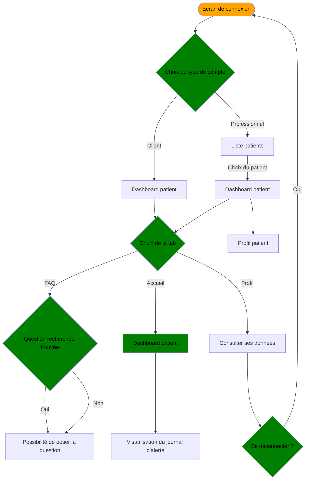

# Parcours UX (optionnel)

Expérience utilisateur détaillée, points de friction, améliorations possibles.

```mermaid

flowchart TD
    A@{ shape: stadium, label: "Ecran de connexion" } --> B{Choix du type de compte}

    B -->|Client| C[Dashboard patient]
    B -->|Professionnel| D[Liste patients]

    C --> G{Choix de la tab}

    G --> |FAQ|H{Question recherchée trouvée}
    G --> |Accueil|E[Dashboard patient]
    G --> |Profil|I[Consulter ses données]

    E --> F[Visualisation du journal d'alerte]

    H --> |Oui|J[Visualisation de la reponse]
    H --> |Non|J[Possibilité de poser la question]

    I --> K{Se deconnecter ?}

    K --> |Oui|A

    D --> |Choix du patient|L[Dashboard patient]

    L --> M[Profil patient]

    L --> G

    style A fill:#ffa500, color: #000
    style B fill:#008000, color: #000
    style G fill:#008000, color: #000
    style H fill:#008000, color: #000
    style E fill:#008000, color: #000
    style K fill:#008000, color: #000

```
