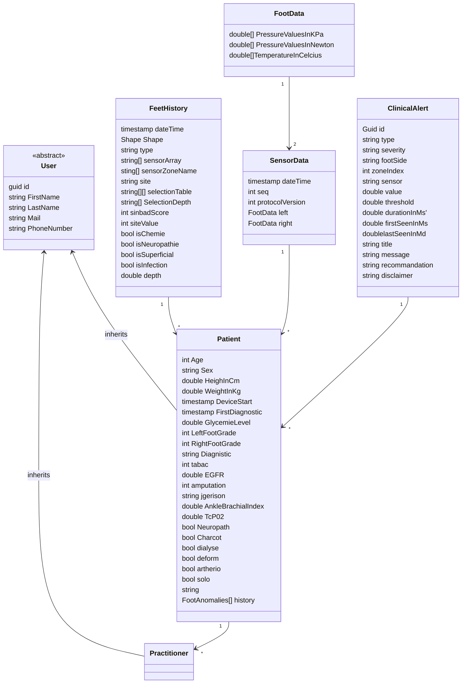

# Data Model

## Liste des entitées

**User** : Classe abstraite representant les utilisateurs de DigiFeet\
**Patient** : Claase representant un patient utilisant le dispositif DigiFeet\
**Practitioner**: Classe representant un practitiens utilisant DigiFeet\
**FeetHistory**: Classe representant un antécedent de l'un des pied d'un patient\
**FootData**: Classe representant l'ensemble des donnée récupérer sur un pied\
**SensorData**": Classe representant les données horodatée des pieds d'un patient\
**ClinicalAlert**: Classe representant les alertes remontées par DigiFeet

## Diagramme de Classe

